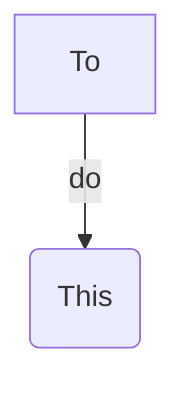

<!-- This content will not appear in the rendered Markdown -->

# Title
title

# Requirements
<details><summary>1. requirements</summary>
<p>nothing</p>
</details>


# Install
<sup> No Installation Required.  </sup>
<sub> Just Git clone or direct download </sub>


## Usage

## **How it works?**
> Magic

## Notes
- https://mermaid-js.github.io/mermaid-live-editor/

- notes

## Dev Notes:
`dev notes`

``` C#
{
  "dev":"note"
}
```


## TODO
- [x] todo1 [^1]
  - [ ] todo2


---

## Sources
- sources

a  | b
--- | ---
1  | 2


[^1]: Todo.
